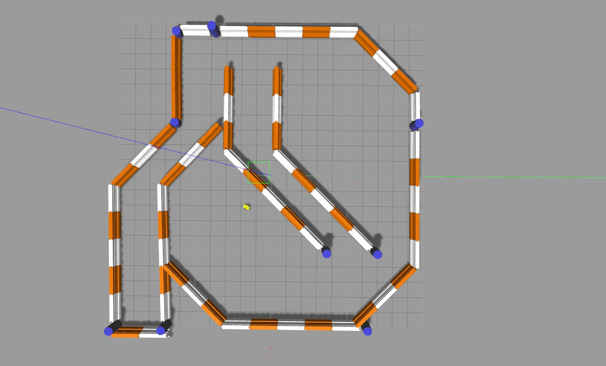

# Udacity\_Bot

Primary ROS Package for Udacity Robotics Nanodegree Term 2 Project 2 : Robot Localization.

Note `scripts/calibrate.py` and `scripts/scan_to_angle.py` are from the `turtlebot_calibration` package.

## Running



```bash
roscore
roslaunch udacity_bot udacity_world.launch robot:=udacity_bot
roslaunch udacity_bot amcl.launch
roslaunch udacity_bot move_base.launch type:=teb
rosrun udacity_bot navigation_goal #_reset:=true
```

In the above script, if `_reset:=true` then the particle filter (AMCL) robot pose will be initialized from the current gazebo ground truth position. (default: false)

Additionally, the goal position can be specified with `_gx`, `_gy` and `gh` parameters.

Note that the current default goal position honors the Udacity-supplied default, (0.995, -2.99, 0.0).

## Visualization


```bash
roslaunch udacity_bot rviz.launch cfg:=amcl
```

## Evaluation


In order to evaluate the localization performance against ground truth data, run:

```bash
rosrun udacity_bot loc_eval.py
```

After the data collection process, plot the collected data as follows:

```bash
rosrun udacity_bot loc_eval.py _plot:=true
```

Note that the collected data is saved under `/tmp/err.npy`.
